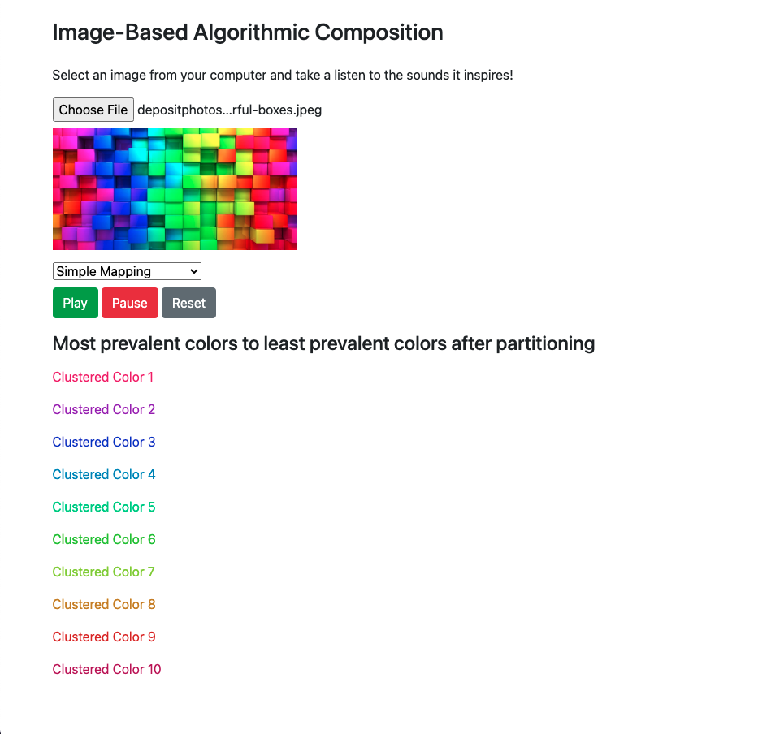

# CS190Final: Image-Based Algorithmic Composition

We have experimented with using data from an image to generate music. In order to imply a clearer relationship between the image and the music, we used the color-pitch mapping from Scriabin's clavier à lumières and based the tonality of the composition off of the image's lightness and saturation. The saturation of a partition also determines the loudness of the notes it is associated with while the lightness of the partition determines the attack time of the note played (with higher lightness sounding more staccato). In order to create something with heavier tonal inspiration, we also implemented some randomized improvisation in the last algorithm setting.

Dependencies: 
This project will not work without npm and http-server. To run this project, run npm install http-server, and then run http-server.

## Image Processing

We partition the uploaded image into a 10x10 grid in order to simplify calculation. We take the average RGB values for each of these partitions, and we then use these values to calculate the HSL values. Hue is generally used for pitch while saturation is used for loudness and lightness is used for articulation. In order to determine the dominant colors, we use k-means clustering.

## Music Modes

### Simple Mapping

This mode chooses notes from the given key (restricted to a single octave) based on the current image partition's average hue. Its rhythm is fixed to two notes per second.

### Scriabin Mapping

On top of using Scriabin's mapping for its key like all other modes, this mode selects a note in the given key by choosing the note associated with an RGB value that is closest by Euclidean distance to the current partition's average. The rhythm is the same as in simple mapping.

### Chord Mapping

This mode is simple mapping except playing the other two notes in the triad within the given octave. This can lead to inverted chords due to the very limited pitch range. Once again, there is no variation in rhythm.

### Randomized Rhythm

This mode is chord mapping except the rhythm is varied. The rhythm is randomly selected such that there is initially a higher probability of seeing the same note length again, but this probability diminishes as the same note length is repeated.

### Randomized Melody

This mode is most unique in that only its bass line and harmony is determined by the hue values of each partition. The melody is randomly generated while the inner voice attempts to fill in missing chord tones.

